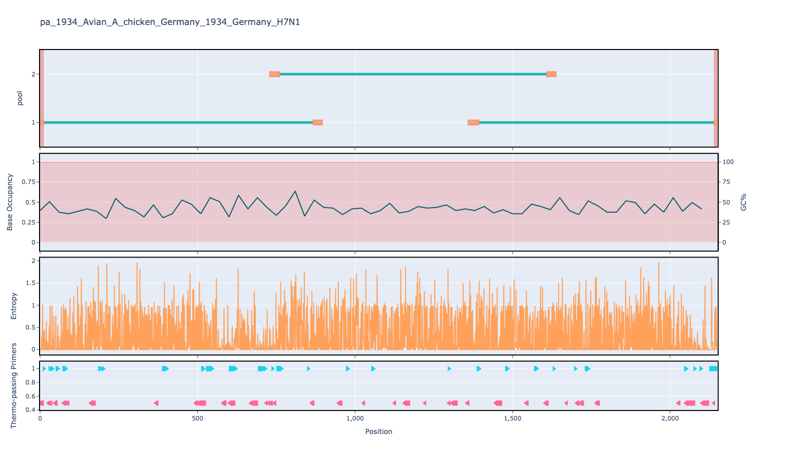
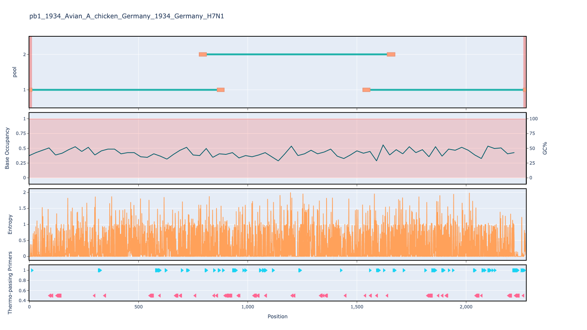
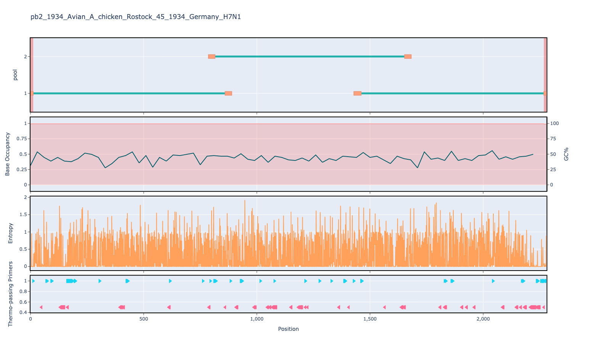

# artic-flu-a 800bp v1.0.0

[primalscheme labs](https://labs.primalscheme.com/detail/artic-flu-a/800/v1.0.0)

## Description

PrimerScheme for influenza A utilising tuni-primers alongside internal-primers for larger segments

## Overviews







## Details

```json
{
    "ampliconsize": 800,
    "schemeversion": "v1.0.0",
    "schemename": "artic-flu-a",
    "primer_bed_md5": "39da1672e070820c42bc9ddfa44d0893",
    "reference_fasta_md5": "e5b5a2d898f9cd25f73bd66d5e8b616f",
    "status": "draft",
    "citations": [],
    "authors": [
        "artic-network"
    ],
    "algorithmversion": "primalscheme3.2.0-artic-flu",
    "species": [
        11320
    ],
    "license": "CC BY-SA 4.0",
    "primerclass": "primerschemes",
    "infoschema": "v2.1.0",
    "articbedversion": "v3.0",
    "collections": [
        "ARTIC"
    ],
    "links": {
        "protocols": [],
        "validation": [],
        "homepage": [],
        "vendors": [],
        "misc": []
    },
    "refselect": null,
    "description": "PrimerScheme for influenza A utilising tuni-primers alongside internal-primers for larger segments",
    "derivedfrom": null,
    "contactinfo": null
}
```


------------------------------------------------------------------------

This work is licensed under a [Creative Commons Attribution-ShareAlike 4.0 International License](http://creativecommons.org/licenses/by-sa/4.0/) 

