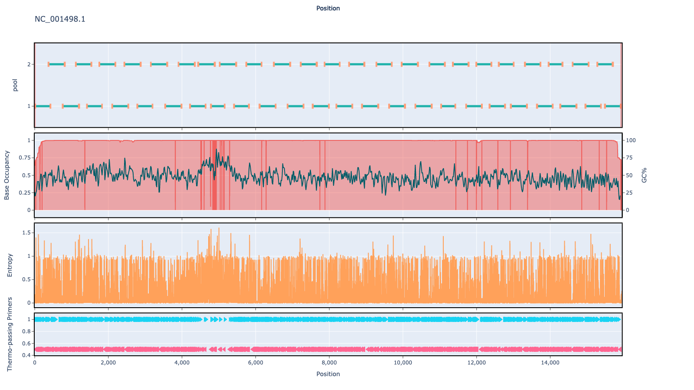

# artic-measles 400bp v1.0.0

## Description

A pan Measles morbillivirus scheme. All full length genomes have been downloaded and phylogenicly downsampled to 0.95 RTL.

## Overviews



## Details

```json
{
    "ampliconsize": 400,
    "schemeversion": "v1.0.0",
    "schemename": "artic-measles",
    "primer_bed_md5": "b8b903356d4c6bd4dc03af04f3a18222",
    "reference_fasta_md5": "2c3dd74742a333dffb50bcfbd158bfbd",
    "status": "draft",
    "citations": [],
    "authors": [
        "Chris Kent",
        "Quick Lab"
    ],
    "algorithmversion": "primalscheme3:1.1.4",
    "species": [
        11234
    ],
    "license": "CC BY-SA 4.0",
    "primerclass": "primerschemes",
    "infoschema": "v1.3.0",
    "articbedversion": "v3.0",
    "description": "A pan Measles morbillivirus scheme. All full length genomes have been downloaded and phylogenicly downsampled to 0.95 RTL.",
    "derivedfrom": null,
    "collections": [
        "WHOLE-GENOME",
        "ARTIC",
        "WASTE-WATER",
        "QUICK-LAB"
    ]
}
```


------------------------------------------------------------------------

This work is licensed under a [Creative Commons Attribution-ShareAlike 4.0 International License](http://creativecommons.org/licenses/by-sa/4.0/) 

