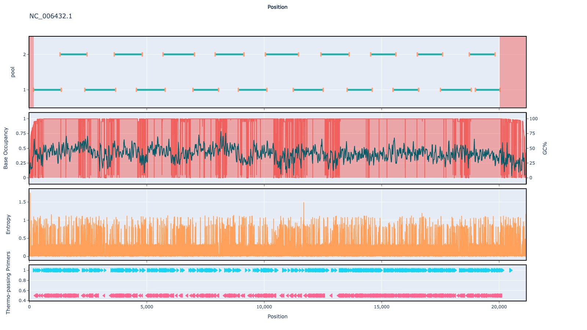

# artic-pan-ebola 1000bp v1.0.0

[primalscheme labs](https://labs.primalscheme.com/detail/artic-pan-ebola/1000/v1.0.0)

## Overviews



## Details

```json
{
    "ampliconsize": 1000,
    "schemeversion": "v1.0.0",
    "schemename": "artic-pan-ebola",
    "primer_bed_md5": "6b9554c28693b521cfbe2246091c61af",
    "reference_fasta_md5": "c5432a6813f9a2604ea5e5e2bb94508e",
    "status": "draft",
    "citations": [],
    "authors": [
        "artic",
        "quick-lab"
    ],
    "algorithmversion": "primalscheme3:1.1.0",
    "species": [
        3044781
    ],
    "license": "CC BY-SA 4.0",
    "primerclass": "primerschemes",
    "infoschema": "v2.0.0",
    "articbedversion": "v3.0",
    "collections": [
        "QUICK-LAB",
        "WHOLE-GENOME",
        "ARTIC",
        "CLINICAL-ISOLATES"
    ],
    "links": {
        "protocols": [],
        "validation": [],
        "homepage": [],
        "vendors": [],
        "misc": []
    },
    "description": null,
    "derivedfrom": null,
    "contactinfo": null
}
```


------------------------------------------------------------------------

This work is licensed under a [Creative Commons Attribution-ShareAlike 4.0 International License](http://creativecommons.org/licenses/by-sa/4.0/) 

