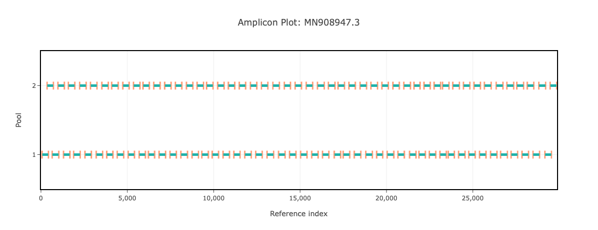

# artic-sars-cov-2 400bp v5.4.2

[primalscheme labs](https://labs.primalscheme.com/detail/artic-sars-cov-2/400/v5.4.2)

## Description

An updated version of v5.3.2, with 4 spike in primers to improve the coverage for mutations found in JN.1

## Overviews



## Details

```json
{
    "ampliconsize": 400,
    "schemeversion": "v5.4.2",
    "schemename": "artic-sars-cov-2",
    "primer_bed_md5": "e7897c8be8e488836ce7777e7709ea53",
    "reference_fasta_md5": "d11d06b5d1eb1d85c69e341c3c026e08",
    "status": "validated",
    "citations": [],
    "authors": [
        "Artic Network",
        "Quick Lab",
        "BCCDC"
    ],
    "algorithmversion": "primalscheme2:1.0.0",
    "species": [
        2697049
    ],
    "license": "CC-BY-4.0",
    "primerclass": "primerschemes",
    "infoschema": "v2.0.0",
    "articbedversion": "v3.0",
    "collections": [
        "WHOLE-GENOME",
        "CLINICAL-ISOLATES",
        "QUICK-LAB",
        "ARTIC",
        "WASTE-WATER"
    ],
    "links": {
        "protocols": [],
        "validation": [
            "https://community.artic.network/t/scheme-release-artic-sars-cov2-400-v5-4-2/546"
        ],
        "homepage": [],
        "vendors": [],
        "misc": []
    },
    "description": "An updated version of v5.3.2, with 4 spike in primers to improve the coverage for mutations found in JN.1",
    "derivedfrom": "artic-sars-cov-2/400/v5.3.2",
    "contactinfo": "c.g.kent@bham.ac.uk"
}
```

