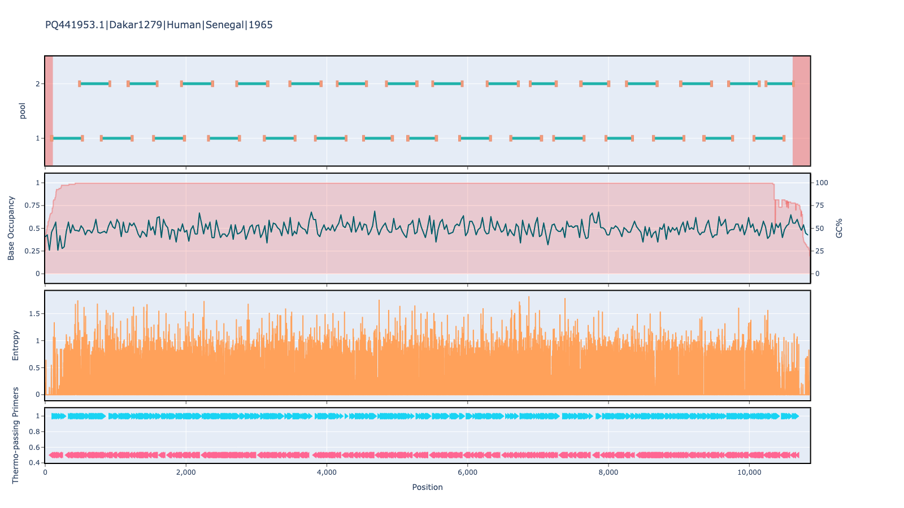

# artic-yfv-west-east-africa 400bp v1.0.0

[primalscheme labs](https://labs.primalscheme.com/detail/artic-yfv-west-east-africa/400/v1.0.0)

## Description

PrimerScheme for yellow fever virus (yfv). Targeted to both east and west african strains.

## Overviews



## Details

```json
{
    "ampliconsize": 400,
    "schemeversion": "v1.0.0",
    "schemename": "artic-yfv-west-east-africa",
    "primer_bed_md5": "f061bf40a679846f0036ec8a9242d281",
    "reference_fasta_md5": "b687d08a0227ccb08f2b79a9b7a0db1c",
    "status": "draft",
    "citations": [],
    "authors": [
        "quick-lab",
        "artic-network"
    ],
    "algorithmversion": "primalscheme:3.0.3",
    "species": [
        11089
    ],
    "license": "CC BY-SA 4.0",
    "primerclass": "primerschemes",
    "infoschema": "v2.1.0",
    "articbedversion": "v3.0",
    "collections": [
        "ARTIC",
        "QUICK-LAB",
        "WHOLE-GENOME"
    ],
    "links": {
        "protocols": [],
        "validation": [],
        "homepage": [],
        "vendors": [],
        "misc": []
    },
    "refselect": null,
    "description": "PrimerScheme for yellow fever virus (yfv). Targeted to both east and west african strains.",
    "derivedfrom": null,
    "contactinfo": null
}
```


------------------------------------------------------------------------

This work is licensed under a [Creative Commons Attribution-ShareAlike 4.0 International License](http://creativecommons.org/licenses/by-sa/4.0/) 

