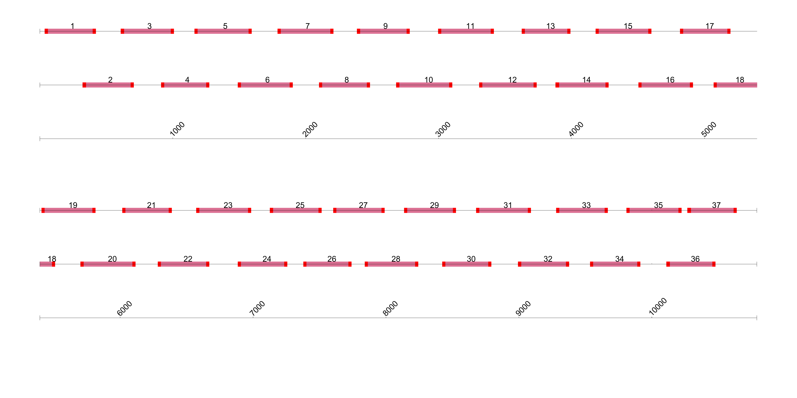

# grubaugh-powassan-virus 400bp v1.0.0

[primalscheme labs](https://labs.primalscheme.com/detail/grubaugh-powassan-virus/400/v1.0.0)

## Description

Primerscheme designed for the whole genome of Powassan virus

## Overviews



## Details

```json
{
    "ampliconsize": 400,
    "schemeversion": "v1.0.0",
    "schemename": "grubaugh-powassan-virus",
    "primer_bed_md5": "0ace7f3f32d025559f81cf7848bd96ca",
    "reference_fasta_md5": "45de4c26388d5f33eeb33d03eaa6594d",
    "status": "tested",
    "citations": [],
    "authors": [
        "Chantal Vogels",
        "Nathan Grubaugh"
    ],
    "algorithmversion": "primalscheme1",
    "species": [
        11082
    ],
    "license": "CC BY-SA 4.0",
    "primerclass": "primerschemes",
    "infoschema": "v2.0.0",
    "articbedversion": "v2.0",
    "collections": [
        "WHOLE-GENOME",
        "COMMUNITY"
    ],
    "links": {
        "protocals": [],
        "validation": [],
        "homepage": [],
        "vendors": [],
        "misc": []
    },
    "description": "Primerscheme designed for the whole genome of Powassan virus",
    "derivedfrom": null,
    "contactinfo": "grubaughlab@gmail.com"
}
```


------------------------------------------------------------------------

This work is licensed under a [Creative Commons Attribution-ShareAlike 4.0 International License](http://creativecommons.org/licenses/by-sa/4.0/) 

