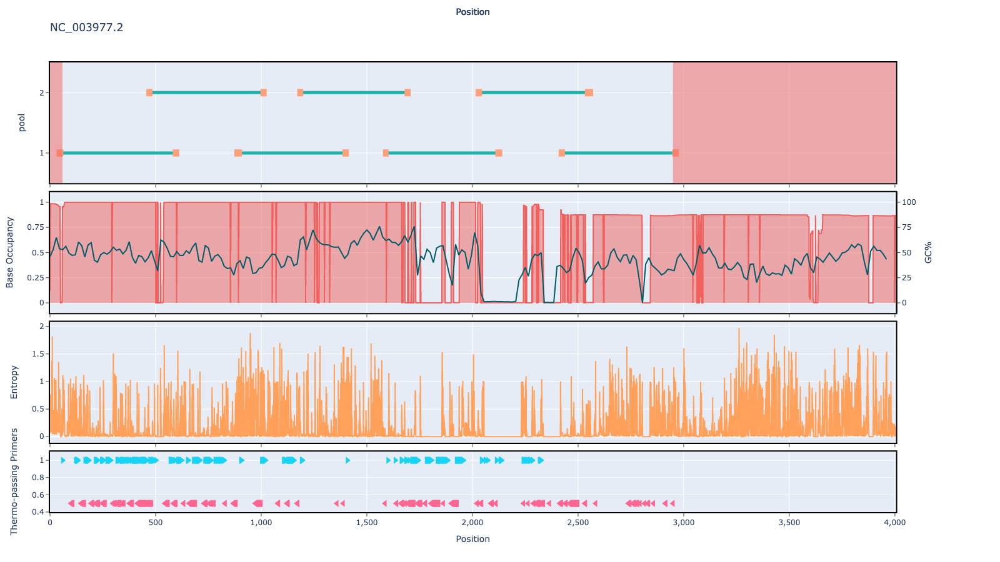

# hbv 500bp v1.0.0

## Description

Schemes generated for the Hepatitis B virus (hbv)

## Overviews



## Details

```json
{
    "ampliconsize": 500,
    "schemeversion": "v1.0.0",
    "schemename": "hbv",
    "primer_bed_md5": "f1874f2b2332dff4b4cd6f0075f128dd",
    "reference_fasta_md5": "7612eab3e2389215206ae17187da1791",
    "status": "draft",
    "citations": [],
    "authors": [
        "quick lab",
        "artic network"
    ],
    "algorithmversion": "primaldigest:1.1.2",
    "species": [
        10407
    ],
    "license": "CC-BY-4.0",
    "primerclass": "primerschemes",
    "infoschema": "v1.0.0",
    "description": "Schemes generated for the Hepatitis B virus (hbv)"
}
```

