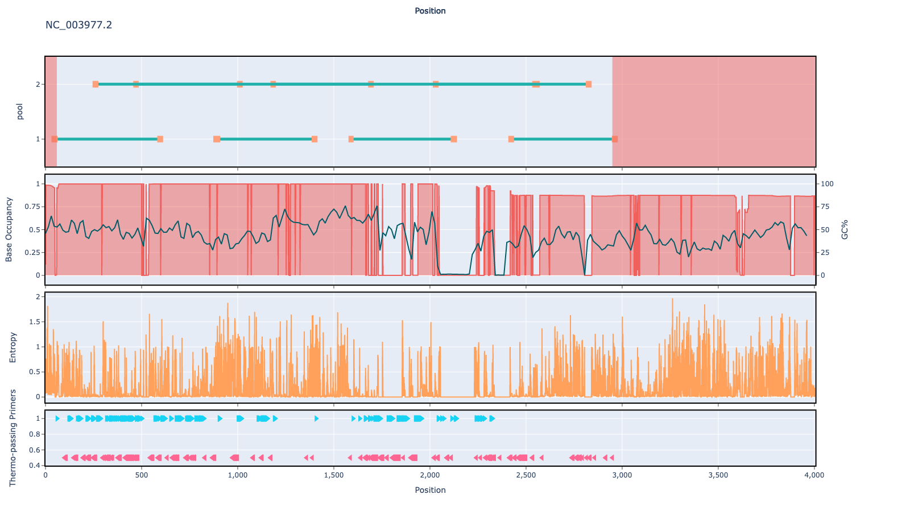

# hbv 500bp v1.1.0

## Description

Schemes generated for the Hepatitis B virus (hbv)

## Overviews



## Details

```json
{
    "ampliconsize": 500,
    "schemeversion": "v1.1.0",
    "schemename": "hbv",
    "primer_bed_md5": "dd96ade2e5c59377808368cc116a8361",
    "reference_fasta_md5": "ba8c5fbd0d52e6d682ee6062bc517ad9",
    "status": "draft",
    "citations": [],
    "authors": [
        "artic network",
        "quick lab"
    ],
    "algorithmversion": "primaldigest:1.1.3",
    "species": [
        10407
    ],
    "license": "CC-BY-4.0",
    "primerclass": "primerschemes",
    "infoschema": "v1.0.0",
    "articbedversion": "v3.0",
    "description": "Schemes generated for the Hepatitis B virus (hbv)",
    "derivedfrom": null
}
```

