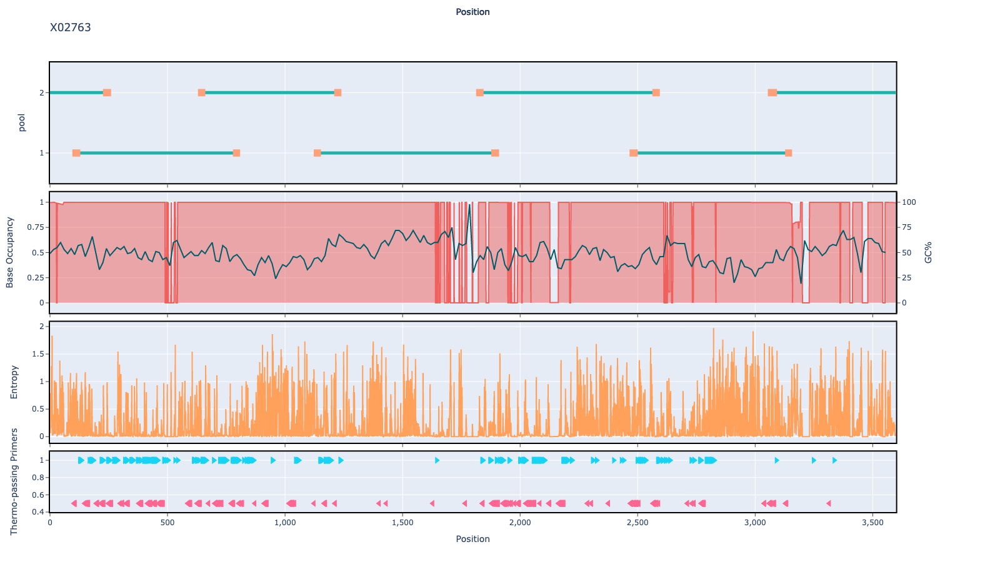

# hbv 600bp v2.1.0

## Description

Contains additional Spike in primers for clades G and H

## Overviews



## Details

```json
{
    "ampliconsize": 600,
    "schemeversion": "v2.1.0",
    "schemename": "hbv",
    "primer_bed_md5": "5af354939e06acc830f7f340720a94b1",
    "reference_fasta_md5": "b0c81b63db38a860016236b68977f38e",
    "status": "draft",
    "citations": [],
    "authors": [
        "Dr Sheila Lumley",
        "Chris Kent",
        "Quick Lab"
    ],
    "algorithmversion": "primalscheme3:1.1.4",
    "species": [
        10407
    ],
    "license": "CC BY-SA 4.0",
    "primerclass": "primerschemes",
    "infoschema": "v1.3.0",
    "articbedversion": "v3.0",
    "description": "Contains additional Spike in primers for clades G and H",
    "derivedfrom": "hbv/600/v2.0.0",
    "collections": [
        "WHOLE-GENOME",
        "QUICK-LAB"
    ]
}
```


------------------------------------------------------------------------

This work is licensed under a [Creative Commons Attribution-ShareAlike 4.0 International License](http://creativecommons.org/licenses/by-sa/4.0/) 

