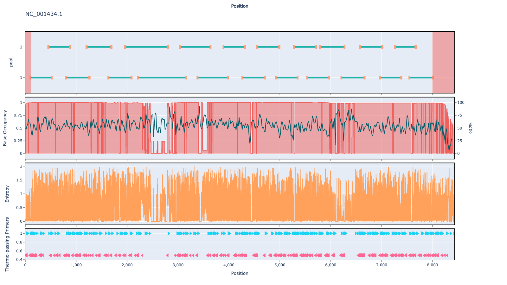

# hev 400bp v1.0.0

## Description

A full genome scheme designed for the Hepatitis E virus. Utilising phylogenic downsampling to reduce representation bias

## Overviews



## Details

```json
{
    "ampliconsize": 400,
    "schemeversion": "v1.0.0",
    "schemename": "hev",
    "primer_bed_md5": "ade0aa4af6881675ffc2203377550bec",
    "reference_fasta_md5": "fd028d0c1bda3584965792fb57cec0a5",
    "status": "draft",
    "citations": [],
    "authors": [
        "artic network",
        "quick lab"
    ],
    "algorithmversion": "primalscheme3:1.1.4",
    "species": [
        291484
    ],
    "license": "CC BY-SA 4.0",
    "primerclass": "primerschemes",
    "infoschema": "v1.3.0",
    "articbedversion": "v3.0",
    "description": "A full genome scheme designed for the Hepatitis E virus. Utilising phylogenic downsampling to reduce representation bias",
    "derivedfrom": null,
    "collections": [
        "QUICK-LAB",
        "WASTE-WATER",
        "WHOLE-GENOME"
    ]
}
```


------------------------------------------------------------------------

This work is licensed under a [Creative Commons Attribution-ShareAlike 4.0 International License](http://creativecommons.org/licenses/by-sa/4.0/) 

