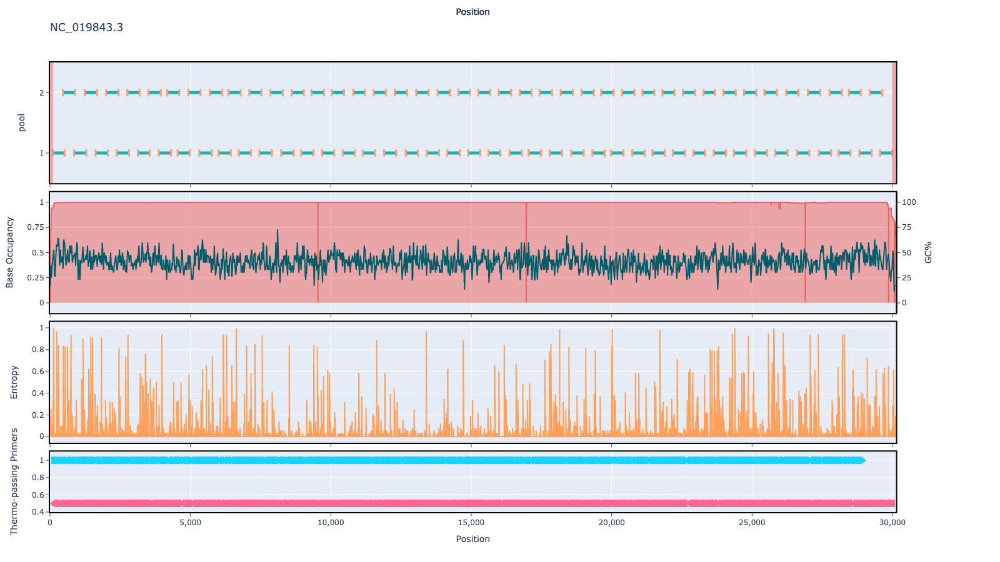

# mers-cov 400bp v1.0.0

## Overviews



## Details

```json
{
    "ampliconsize": 400,
    "schemeversion": "v1.0.0",
    "schemename": "mers-cov",
    "primer_bed_md5": "6853274c2b5b338e7616c99bacef63aa",
    "reference_fasta_md5": "957cb36597491259c943120c55ca57d9",
    "status": "draft",
    "citations": [],
    "authors": [
        "quick lab",
        "artic network"
    ],
    "algorithmversion": "primaldigest:1.2.2",
    "species": [
        1335626
    ],
    "license": "CC BY-SA 4.0",
    "primerclass": "primerschemes",
    "infoschema": "v1.1.0",
    "description": null,
    "derivedfrom": null
}
```


------------------------------------------------------------------------

This work is licensed under a [Creative Commons Attribution-ShareAlike 4.0 International License](http://creativecommons.org/licenses/by-sa/4.0/) 

