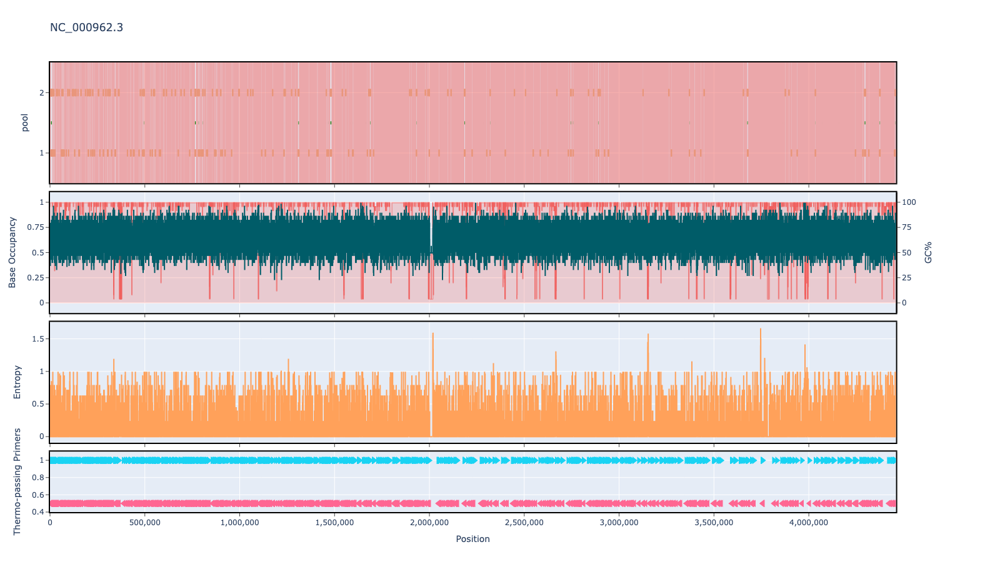

# modjadji-tb-panel 400bp v1.0.0

[primalscheme labs](https://labs.primalscheme.com/detail/modjadji-tb-panel/400/v1.0.0)

## Description

A primer panel for targeting full-length AMR genes and typing snps from mycobacterium tuberculosis

## Overviews



## Details

```json
{
    "ampliconsize": 400,
    "schemeversion": "v1.0.0",
    "schemename": "modjadji-tb-panel",
    "primer_bed_md5": "ca02b57a963539ca5618e712f2ad7c10",
    "reference_fasta_md5": "0e8f3acd2c92f20c42105e014adbfe97",
    "status": "draft",
    "citations": [],
    "authors": [
        "articnetwork",
        "modjadji"
    ],
    "algorithmversion": "primalscheme3",
    "species": [
        1773
    ],
    "license": "CC BY-SA 4.0",
    "primerclass": "primerschemes",
    "infoschema": "v2.1.0",
    "articbedversion": "v3.0",
    "collections": [],
    "links": {
        "protocols": [],
        "validation": [],
        "homepage": [],
        "vendors": [],
        "misc": []
    },
    "refselect": null,
    "description": "A primer panel for targeting full-length AMR genes and typing snps from mycobacterium tuberculosis",
    "derivedfrom": null,
    "contactinfo": null
}
```


------------------------------------------------------------------------

This work is licensed under a [Creative Commons Attribution-ShareAlike 4.0 International License](http://creativecommons.org/licenses/by-sa/4.0/) 

