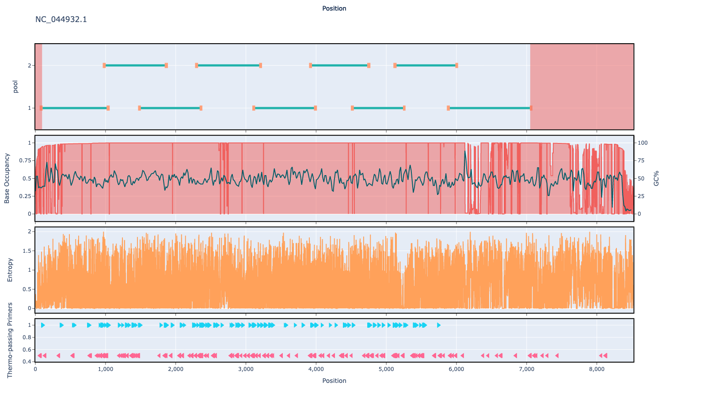

# norovirus-gii 800bp v1.0.0

## Description

A scheme designed for pan Norovirus gii

## Overviews



## Details

```json
{
    "ampliconsize": 800,
    "schemeversion": "v1.0.0",
    "schemename": "norovirus-gii",
    "primer_bed_md5": "3191ec8a80f14a5688d561fe2cf77e34",
    "reference_fasta_md5": "d128fe1bf5abe0d68f0f33ecccd4b79e",
    "status": "draft",
    "citations": [],
    "authors": [
        "quick lab",
        "artic network"
    ],
    "algorithmversion": "primaldigest:1.2.2",
    "species": [
        122929
    ],
    "license": "CC BY-SA 4.0",
    "primerclass": "primerschemes",
    "infoschema": "v1.0.0",
    "articbedversion": "v3.0",
    "description": "A scheme designed for pan Norovirus gii",
    "derivedfrom": null
}
```


------------------------------------------------------------------------

This work is licensed under a [Creative Commons Attribution-ShareAlike 4.0 International License](http://creativecommons.org/licenses/by-sa/4.0/) 

