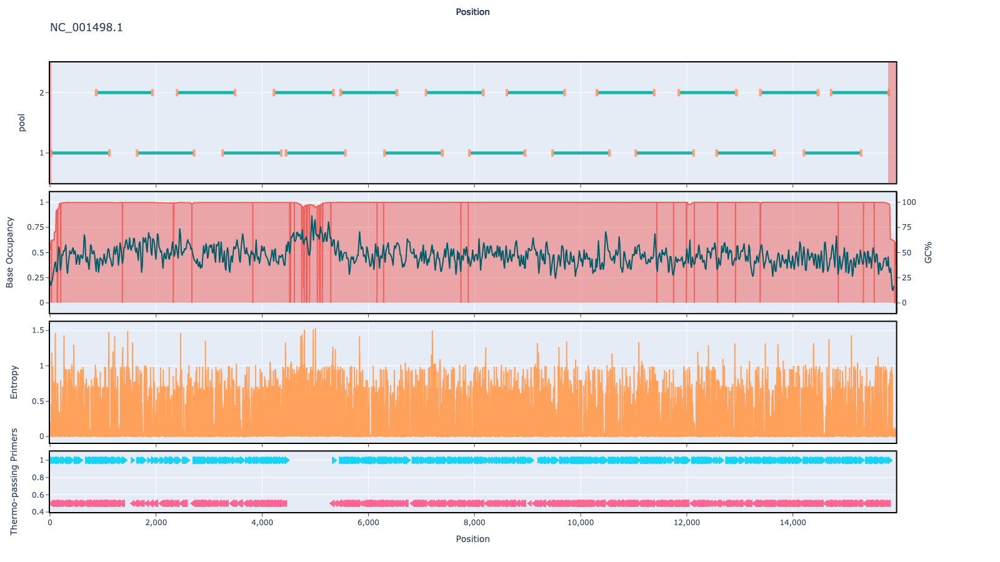

# pan-measles 1000bp v1.0.0

## Overviews



## Details

```json
{
    "ampliconsize": 1000,
    "schemeversion": "v1.0.0",
    "schemename": "pan-measles",
    "primer_bed_md5": "0be34569ff26f64d1c4b801661f90c9f",
    "reference_fasta_md5": "64a52bcc7c18986db1c11813db518390",
    "status": "draft",
    "citations": [],
    "authors": [
        "artic network",
        "quick lab"
    ],
    "algorithmversion": "primaldigest:1.2.2",
    "species": [
        11234
    ],
    "license": "CC BY-SA 4.0",
    "primerclass": "primerschemes",
    "infoschema": "v1.1.0",
    "description": null,
    "derivedfrom": null
}
```


------------------------------------------------------------------------

This work is licensed under a [Creative Commons Attribution-ShareAlike 4.0 International License](http://creativecommons.org/licenses/by-sa/4.0/) 

