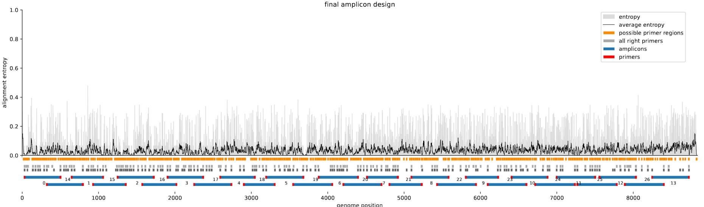

# varvamp-bodv-1 400bp v1.0.0

[primalscheme labs](https://labs.primalscheme.com/detail/varvamp-bodv-1/400/v1.0.0)

## Description

Pan-specfic primer scheme for BoDV-1 designed with varVAMP on the basis of full length genomes. The design utilizes degenerated primers and was validated on clinical samples and isolates.

## Overviews



## Details

```json
{
    "ampliconsize": 400,
    "schemeversion": "v1.0.0",
    "schemename": "varvamp-bodv-1",
    "primer_bed_md5": "ee859faf41cfd7c5c662a1b4b11ec478",
    "reference_fasta_md5": "47f4b12bac1051c565b535623f5e4098",
    "status": "validated",
    "citations": [],
    "authors": [
        "Jonas Fuchs"
    ],
    "algorithmversion": "varVAMP:0.6",
    "species": [
        1714621
    ],
    "license": "CC BY-SA 4.0",
    "primerclass": "primerschemes",
    "infoschema": "v2.0.0",
    "articbedversion": "v3.0",
    "collections": [
        "CLINICAL-ISOLATES",
        "WHOLE-GENOME",
        "COMMUNITY"
    ],
    "links": {
        "protocols": [],
        "validation": [
            "https://www.biorxiv.org/content/10.1101/2024.05.08.593102v1.full"
        ],
        "homepage": [
            "https://github.com/jonas-fuchs/ViralPrimerSchemes/tree/main/varvamp_tiled/BoDV"
        ],
        "vendors": [],
        "misc": []
    },
    "description": "Pan-specfic primer scheme for BoDV-1 designed with varVAMP on the basis of full length genomes. The design utilizes degenerated primers and was validated on clinical samples and isolates.",
    "derivedfrom": null,
    "contactinfo": "jonas.fuchs@uniklinik-freiburg.de"
}
```


------------------------------------------------------------------------

This work is licensed under a [Creative Commons Attribution-ShareAlike 4.0 International License](http://creativecommons.org/licenses/by-sa/4.0/) 

