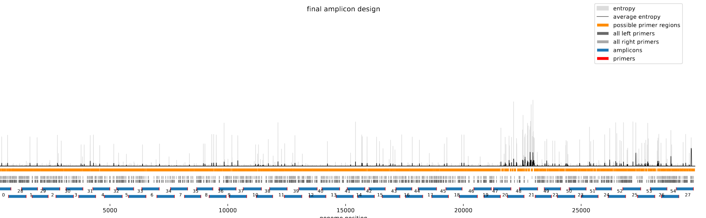

# varvamp-sars-cov-2 700bp v1.0.0

[primalscheme labs](https://labs.primalscheme.com/detail/varvamp-sars-cov-2/700/v1.0.0)

## Description

Pan-specfic primer scheme for SARS-CoV-2 designed with varVAMP on the basis of full length genomes. The design utilizes degenerated primers and was validated on clinical samples and isolates.

## Overviews



## Details

```json
{
    "ampliconsize": 700,
    "schemeversion": "v1.0.0",
    "schemename": "varvamp-sars-cov-2",
    "primer_bed_md5": "dd970083426f3c0d986ce105548fb4c9",
    "reference_fasta_md5": "c12180b68bcc554de9fa27522e491592",
    "status": "validated",
    "citations": [],
    "authors": [
        "Jonas Fuchs"
    ],
    "algorithmversion": "varVAMP:0.9.4",
    "species": [
        2697049
    ],
    "license": "CC BY-SA 4.0",
    "primerclass": "primerschemes",
    "infoschema": "v2.0.0",
    "articbedversion": "v3.0",
    "collections": [
        "WHOLE-GENOME",
        "COMMUNITY",
        "CLINICAL-ISOLATES"
    ],
    "links": {
        "protocols": [],
        "validation": [
            "https://www.biorxiv.org/content/10.1101/2024.05.08.593102v1.full"
        ],
        "homepage": [
            "https://github.com/jonas-fuchs/ViralPrimerSchemes/tree/main/varvamp_tiled/SARS-CoV-2_2"
        ],
        "vendors": [],
        "misc": []
    },
    "description": "Pan-specfic primer scheme for SARS-CoV-2 designed with varVAMP on the basis of full length genomes. The design utilizes degenerated primers and was validated on clinical samples and isolates.",
    "derivedfrom": null,
    "contactinfo": "jonas.fuchs@uniklinik-freiburg.de"
}
```


------------------------------------------------------------------------

This work is licensed under a [Creative Commons Attribution-ShareAlike 4.0 International License](http://creativecommons.org/licenses/by-sa/4.0/) 

