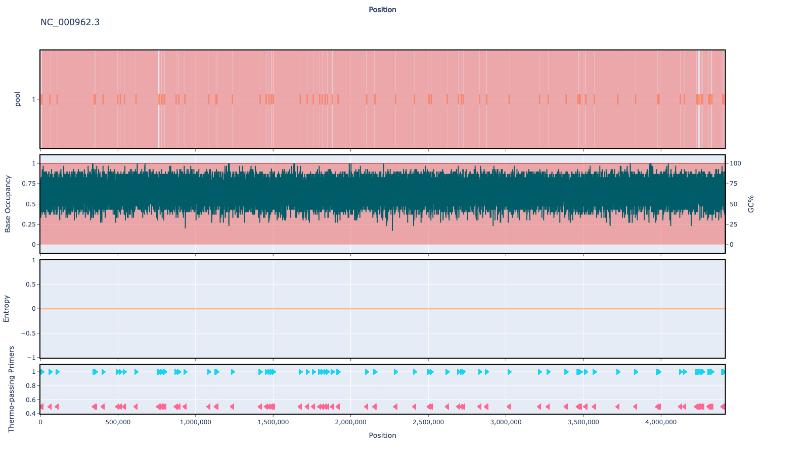

# who-tb-amr-panel 1000bp v1.0.0

## Description

A panel containing ~1200 mutations in WHO/UCN/GTB/PCI/2021.7, alongside 60 typing snps described in DOI: 10.1038/ncomms5812

## Overviews



## Details

```json
{
    "ampliconsize": 1000,
    "schemeversion": "v1.0.0",
    "schemename": "who-tb-amr-panel",
    "primer_bed_md5": "5de2031db0062acbc75b2ad7d3de40f4",
    "reference_fasta_md5": "77cabd2a9f46614628d15371081ab4a1",
    "status": "draft",
    "citations": [],
    "authors": [
        "quick lab",
        "artic network"
    ],
    "algorithmversion": "primalpanel:0.1.0",
    "species": [
        1773
    ],
    "license": "CC BY-SA 4.0",
    "primerclass": "primerschemes",
    "infoschema": "v1.1.0",
    "description": "A panel containing ~1200 mutations in WHO/UCN/GTB/PCI/2021.7, alongside 60 typing snps described in DOI: 10.1038/ncomms5812",
    "derivedfrom": null
}
```


------------------------------------------------------------------------

This work is licensed under a [Creative Commons Attribution-ShareAlike 4.0 International License](http://creativecommons.org/licenses/by-sa/4.0/) 

