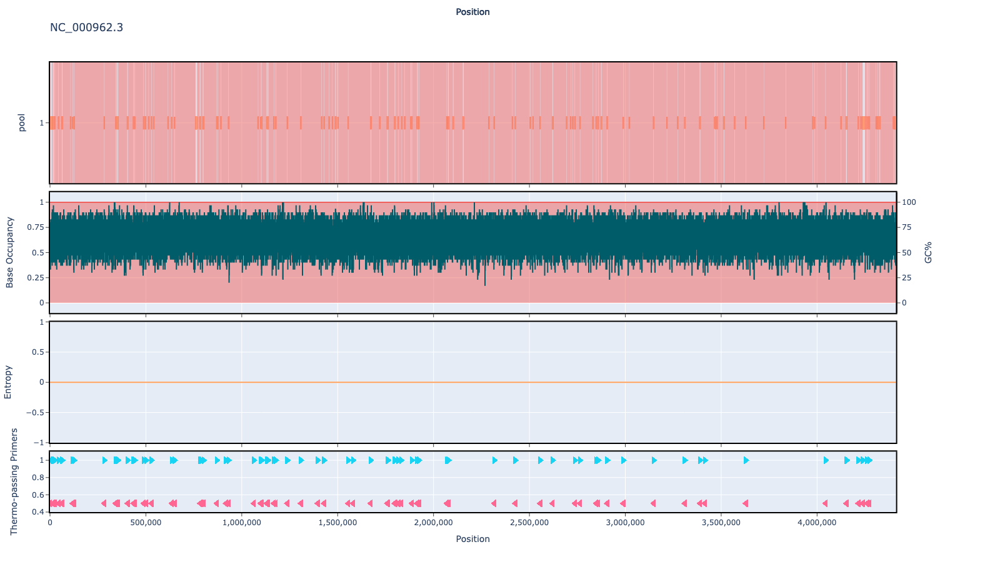

# who-tb-amr-panel 1000bp v2.0.0

[primalscheme labs](https://labs.primalscheme.com/detail/who-tb-amr-panel/1000/v2.0.0)

## Description

An updated version of who-tb-amr-panel/1000/v1.0.0, with 60 aditional amplicions to cover WHO-UCN-TB-2023 Mutations and the Freschi 2020 typing snps

## Overviews



## Details

```json
{
    "ampliconsize": 1000,
    "schemeversion": "v2.0.0",
    "schemename": "who-tb-amr-panel",
    "primer_bed_md5": "a63b24ae3669ebfd11c938c9fa37d648",
    "reference_fasta_md5": "77cabd2a9f46614628d15371081ab4a1",
    "status": "draft",
    "citations": [],
    "authors": [
        "Chris Kent",
        "Quick lab"
    ],
    "algorithmversion": "primalscheme3:1.1.2",
    "species": [
        1773
    ],
    "license": "CC BY-SA 4.0",
    "primerclass": "primerschemes",
    "infoschema": "v2.0.0",
    "articbedversion": "v3.0",
    "collections": [
        "QUICK-LAB",
        "PANEL",
        "MODJADJI"
    ],
    "links": {
        "protocols": [],
        "validation": [],
        "homepage": [],
        "vendors": [],
        "misc": []
    },
    "description": "An updated version of who-tb-amr-panel/1000/v1.0.0, with 60 aditional amplicions to cover WHO-UCN-TB-2023 Mutations and the Freschi 2020 typing snps",
    "derivedfrom": "who-tb-amr-panel/1000/v1.0.0",
    "contactinfo": null
}
```


------------------------------------------------------------------------

This work is licensed under a [Creative Commons Attribution-ShareAlike 4.0 International License](http://creativecommons.org/licenses/by-sa/4.0/) 

